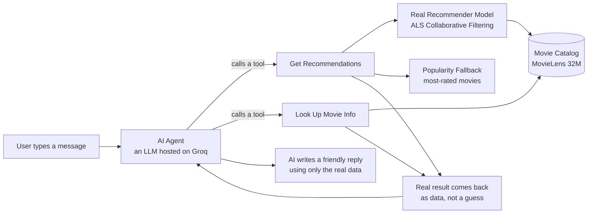

# 🎬 CineMatch — Conversational Movie Recommender (LLM Agent + Collaborative Filtering)

### 🔗 [Try the live app](https://ar875-movie-recommender-chatbot-app-lxqtc8.streamlit.app)

> Note: the first message after the app has been idle may take 30-60 seconds
> while it downloads the trained model in the background — this is a one-time
> cold start, not a bug.

A movie recommendation system that lets you *talk* to it instead of clicking
filters. You can say things like *"I loved Inception, what should I watch
next?"* or *"recommend something for user 45"* or *"what genre is Toy
Story?"* — and it gives you a real answer, pulled from an actual
recommendation model and a real movie catalog, not made up by an AI guessing.

This project combines two things that are normally separate:
1. A **traditional recommender system** (the kind Netflix/Amazon use under
   the hood) — accurate, but can't hold a conversation.
2. A **conversational AI agent** (like a chatbot) — great at talking, but
   with no real knowledge of movies or users unless you give it tools to look
   things up.

I built this to practice, and show, a complete data science workflow: explore
the data, build and properly test a real model, add an AI chat layer on top
of it, and then test the whole system rigorously — including being honest
about where it breaks.

---

## Table of Contents
- [The problem, in plain terms](#the-problem-in-plain-terms)
- [How it works (architecture)](#how-it-works-architecture)
- [The dataset](#the-dataset)
- [What I did, phase by phase](#what-i-did-phase-by-phase)
  - [Phase 1 — Exploring the data](#phase-1--exploring-the-data)
  - [Phase 2 — Building a real recommender](#phase-2--building-a-real-recommender)
  - [Phase 3 — Adding the AI chat layer](#phase-3--adding-the-ai-chat-layer)
  - [Phase 4 — Testing it properly](#phase-4--testing-it-properly)
- [Challenges I ran into, and how I fixed them](#challenges-i-ran-into-and-how-i-fixed-them)
- [Limitations — what this project doesn't do (yet)](#limitations--what-this-project-doesnt-do-yet)
- [What I'd do next with more time](#what-id-do-next-with-more-time)
- [Tech stack](#tech-stack)
- [How to run it yourself](#how-to-run-it-yourself)

---

## The problem, in plain terms

Normal recommender systems (the math-heavy kind) are good at predicting "you
might like this," but they're rigid. You can't ask them "why did you pick
this?" or say "actually, something shorter please." They just spit out a
list.

Chatbots like ChatGPT are the opposite problem — they're great at
conversation, but they don't know your real watch history or what movies
actually exist in a specific catalog. If you ask one for a recommendation, it
might just make something up that sounds right but isn't real (this is
called **hallucination**, and it's a big deal in real AI products).

This project tries to get the best of both: a real recommendation model
underneath, with an AI chat layer on top that's *only allowed* to talk about
real results from that model — not its own guesses.

---

## How it works (architecture)



**In plain words:** when you type something, the AI doesn't just answer from
its own memory. It decides which "tool" to use (get a recommendation, or look
up a fact), that tool goes and checks the *real* data, and only then does the
AI write a reply — using the real answer it got back, not something it made
up. This is called **tool calling** or **function calling**, and it's the key
idea that keeps the chatbot honest.

**How the recommendation tool decides what to do:**
1. If it knows a specific `user_id` — it gives a personalized recommendation
   using the real collaborative filtering model.
2. If the user mentions a movie they liked (like "Inception") — it finds
   similar movies using the model's learned patterns.
3. If neither — it just shows the most popular movies as a safe fallback.

A second, simpler tool handles factual questions like "what genre is this
movie" — it doesn't touch the recommender at all, just looks the movie up in
the catalog directly.

---

## The dataset

I used **MovieLens 32M** — a free, public dataset with about **32 million
movie ratings**, from roughly 200,000 users, covering about 87,000 movies.
It's one of the most commonly used datasets for building and testing
recommender systems, so it's a good, credible choice for a portfolio project.

Since a lot of users and movies in the raw data have very few ratings (not
enough to learn anything useful from), I filtered out users and movies with
fewer than 10 ratings before training anything. This is a standard,
defensible step — not "cheating," just cleaning.

---

## What I did, phase by phase

### Phase 1 — Exploring the data

Before building anything, I spent time just looking at the data carefully.
Some things I found:

- **A small number of movies get most of the attention.** This is called the
  "long tail" — a handful of blockbuster movies get tons of ratings, while
  most movies get barely any. This matters because a lazy recommender could
  just recommend popular movies to everyone and look "okay" without actually
  being personalized — which is exactly why I built a popularity baseline
  later, to make sure my real model actually beat that lazy option.
- **A real cold-start problem exists.** A meaningful chunk of users and
  movies have almost no rating history, which makes them hard to recommend
  for/find good matches for.
- **Genres are unevenly distributed** — some genres like Drama and Comedy
  dominate the catalog, and some genres tend to get rated higher on average
  than others.
- The dataset also had a `tags.csv` file with free-text tags people added to
  movies (like "mind-bending" or "dark comedy") — interesting extra context,
  though I didn't end up using it in the final model.

### Phase 2 — Building a real recommender

**What I built:** an **ALS (Alternating Least Squares)** model — a real,
production-style collaborative filtering technique. In plain terms, it looks
at everyone's rating patterns and learns hidden "taste profiles" for both
users and movies, then predicts which movies a user is likely to enjoy based
on those learned profiles.

**How I tested it fairly:** I used a **time-based split** — for each user, I
hid their *most recent* rating and tried to predict it, using everything
*before* that as training data. This is more realistic than randomly hiding
ratings, because in real life you're always trying to predict what someone
will watch *next*, not something random from their past.

**The baseline I compared against:** the simplest possible recommender —
just recommend whatever's most popular to everyone. Every real model needs
to prove it's better than this, or there's no point using it.

**Results:**

| Metric | Just-Show-Popular Baseline | My ALS Model | How much better |
|---|---|---|---|
| Precision@10 | 0.0023 | 0.0096 | **about 4.2x better** |
| Recall@10 | 0.023 | 0.096 | **about 4.2x better** |
| NDCG@10 | 0.0104 | 0.0494 | **about 4.8x better** |

**Why these numbers look small:** don't worry, this is expected, not a
mistake. Each user only has ONE movie they actually watched next, hidden
among tens of thousands of possible movies — so even a really good model
will "only" get it right a small percentage of the time. What actually
matters is the **comparison** — my real model was about 4-5 times better than
just guessing popular movies, which proves there's real, learnable
personalization signal in the data.

### Phase 3 — Adding the AI chat layer

I put an AI language model in front of the recommender, using **tool
calling** — a feature where the AI can decide "I need to call a function to
get real information" instead of just answering from its own training data.

I used an **open-source AI model hosted for free by Groq** (since I didn't
want to spend money before proving the whole idea works). I built two tools
for it:
1. **Get recommendations** — wraps my real ALS model
2. **Look up movie info** — checks real facts like genre from the catalog

I also had to build a **fuzzy title-matching system**, because people don't
type exact movie titles — someone might type "inception" instead of the
catalog's exact "Inception (2010)". This turned out to be trickier than
expected (see the Challenges section below).

### Phase 4 — Testing it properly

This is the part most portfolio projects skip, and it's the part that
actually matters most for a real data science interview: **proving the
system works, with numbers, instead of just trying a few examples and hoping
for the best.**

I wrote **25 test questions** covering every situation the agent should
handle: someone naming a movie they liked, someone giving a user ID, vague
requests like "I'm bored," factual questions, typos, and even messages
completely unrelated to movies (to make sure it doesn't break or hallucinate
on those either).

For each one, I automatically checked two things:
1. **Did the AI use the correct tool/approach?** ("intent accuracy")
2. **Did every movie it mentioned actually come from the real data, or did it
   make something up?** ("hallucination rate")

**Final results:**

| What I measured | Result |
|---|---|
| Correctly used the right tool/approach | **100%** (19 out of 19 applicable test cases) |
| Made up a fake movie/fact not in the real data | **4.3%** (1 out of 23) — and when I checked that one case by hand, it turned out to be a bug in my *testing script*, not the AI actually making something up (explained below) |
| Average time per response | **1.51 seconds** |

---

## Challenges I ran into, and how I fixed them

This project had a LOT of real debugging along the way — I'm including the
details here on purpose, because working through real bugs like this is
exactly what a data science/ML job actually looks like day to day, and it's
more convincing than a story where "everything just worked."

**1. The recommender model was trained backwards.**
The library I used for the collaborative filtering model (`implicit`)
expected the data to be shaped a specific way (rows = users, columns =
movies), but I initially built it the other way around (rows = movies,
columns = users). The model still "trained" without complaining — it just
silently learned the wrong thing. It only showed up later as a confusing
`IndexError` when trying to generate recommendations. **Fix:** rebuilt the
data matrix in the correct orientation and re-trained.

**2. Fuzzy movie title matching kept picking the wrong movie.**
When someone typed "The Dark Knight," my matching code sometimes matched it
to the wrong catalog entry, because MovieLens stores titles in an unusual way
— like `"Dark Knight, The (2008)"` instead of `"The Dark Knight (2008)"`. On
top of that, the catalog had a few duplicate/mislabeled entries for the same
movie (like a mysteriously wrong-year duplicate). **Fix:** I normalized
titles by moving "The"/"A"/"An" and stripping the year before comparing, and
when multiple matches were possible, I picked whichever one had the most
ratings — since that's almost always the "real" popular movie, not an
obscure duplicate.

**3. The free AI hosting service (Groq) kept changing which models were
available.**
A model I picked (`llama-3.3-70b-versatile`) stopped being available
partway through the project without warning — a good reminder that "free"
AI services can change their offerings at any time. **Fix:** wrote a small
script to check which models were actually available on my account right
now, instead of hardcoding a model name and hoping it stays available.

**4. The AI sometimes tried to call a tool incorrectly, causing API errors.**
Groq's API is stricter than OpenAI's about data types — if my tool said a
parameter should be "a string," and the AI tried to pass "nothing" (`null`)
instead, Groq's API would flatly reject the whole request with an error,
instead of just ignoring it. **Fix:** updated my tool definitions to
explicitly allow "string or nothing" instead of just "string."

**5. The AI made up a fake detail (movie runtime) that I never gave it.**
When I asked for "something shorter," the AI just invented believable-sounding
runtime numbers, since I never actually gave it that information. This was a
real, confirmed hallucination — not okay for a system that's supposed to only
state real facts. **Fix:** I explicitly told the AI in its instructions: "if
you don't have a piece of information from a tool, say so — don't guess."

**6. My own testing script had bugs that made the AI look worse than it
actually was.**
This one surprised me the most. A few times, my automatic hallucination
checker flagged the AI for "making things up" — but when I manually checked,
the AI had actually given a 100% correct, real answer. The bug was in my
*checker*, not the AI:
   - MovieLens formats titles inconsistently (`"Matrix, The"` vs `"The
     Matrix"`), and my checker didn't account for that at first.
   - The AI sometimes used a special "narrow space" character between words
     (like in "vs.") instead of a normal space, which broke my text-matching
     logic even though the words were identical.
   - My checker only checked movie *titles* for accuracy — so when the AI
     correctly stated a movie's *genre* (a totally different type of fact,
     also pulled from real data), my checker had no way to verify it and
     just assumed it might be fake.

   **Lesson:** when you build your own evaluation/testing tools, you have to
   test *those* too — a broken test can make a working system look broken,
   and you won't know unless you dig into every flagged case by hand instead
   of just trusting the summary number.

---

## Limitations — what this project doesn't do (yet)

Being upfront about what doesn't work well is just as important as showing
what does — it shows I actually understand the system, not just that I got
lucky with good results.

- **Recommendations are based on behavior, not content.** My model
  recommends based on "people who liked A also liked B" — it has no idea
  what a movie is actually *about*. This occasionally leads to odd pairings
  (like recommending a serious historical drama alongside a superhero movie,
  just because similar people happened to rate both highly).
- **The AI can't apply filters it wasn't specifically built for.** If you say
  "something shorter" or "something newer," it can only choose from movies
  already mentioned earlier in the conversation — it has no actual way to
  filter by runtime or release year, because I never gave it that ability.
- **My hallucination checker isn't perfect.** It only checks movie titles for
  accuracy, not other facts like genres — so a small number of totally
  correct answers get incorrectly flagged as "unverified" by my testing
  script, even though they're actually fine.
- **New users with zero history only get generic popular recommendations** —
  there's no smarter cold-start handling (like asking a few quick preference
  questions first).
- **Free AI hosting services can change at any time.** Since I used a free
  tier (Groq), the exact model I used could be removed or renamed in the
  future, the same way an earlier model I tried already was mid-project.
- **The live demo has a slow cold start.** Since the trained model file is
  too large for GitHub and is hosted separately on Hugging Face, the app
  downloads it fresh the first time it wakes up (after being idle), adding
  30-60 seconds before the first reply. A production system would keep the
  model warm in memory or use a proper model-serving setup instead of a
  download-on-startup pattern.

---

## What I'd do next with more time

- Add a genre/content-based similarity blend, so recommendations aren't
  purely behavior-based — this would likely fix the "odd pairing" issue
  above.
- Add real filters (runtime, release year, specific genre) as proper tool
  parameters, so requests like "something shorter" actually work instead of
  just re-picking from already-shown options.
- Expand the hallucination checker to validate every type of fact the AI
  might state (genres, years, etc.), not just movie titles.
- Add a lightweight "cold-start" flow — a couple of quick questions for brand
  new users before falling back to generic popular picks.
- Move from a free-tier AI model to a paid, more capable one (like GPT-4o
  mini) for a final quality pass, now that the core logic is proven to work.

---

## Tech stack

- **Data & modeling:** pandas, NumPy, `implicit` (ALS collaborative
  filtering), scikit-learn
- **AI / conversational layer:** Groq API (free tier, OpenAI-compatible),
  `openai` Python library, function/tool calling
- **App / UI:** Streamlit, deployed on Streamlit Community Cloud
- **Model hosting:** the trained model file (~300MB) is hosted on Hugging
  Face Hub and downloaded by the app at startup, since it's too large for a
  normal GitHub push (GitHub's hard limit is 100MB per file)
- **Testing:** custom-built precision/recall/NDCG evaluation code, and a
  custom hallucination-detection checker
- **Where I built it:** Kaggle Notebooks (moved here after running into RAM
  limits on Google Colab's free tier)
- **Dataset:** MovieLens 32M

---

## How to run it yourself

**Just want to try it?** Use the [live demo link](https://ar875-movie-recommender-chatbot-app-lxqtc8.streamlit.app) at the top of this page — no setup needed.

**Want to run the full pipeline yourself (notebooks + app)?**

1. Download the [MovieLens 32M dataset](https://grouplens.org/datasets/movielens/).
2. Run the EDA notebook first to explore and clean the data.
3. Run the baseline recommender notebook to train the ALS model and see the
   Phase 2 comparison results.
4. Get a free API key from [Groq](https://console.groq.com).
5. Run the agent notebook to chat with the recommender.
6. Run the evaluation notebook to reproduce the Phase 4 test results.

**Want to run the chat app locally instead of the notebooks?**

```bash
git clone https://github.com/ar875/movie-recommender-chatbot.git
cd movie-recommender-chatbot
pip install -r requirements.txt
```
Create `.streamlit/secrets.toml` with your own `GROQ_API_KEY`, then:
```bash
streamlit run app.py
```
The trained model will download automatically from Hugging Face on first run.
